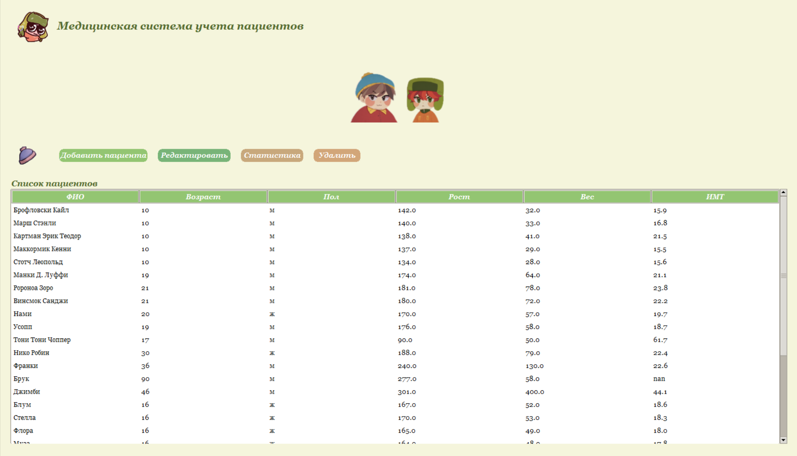
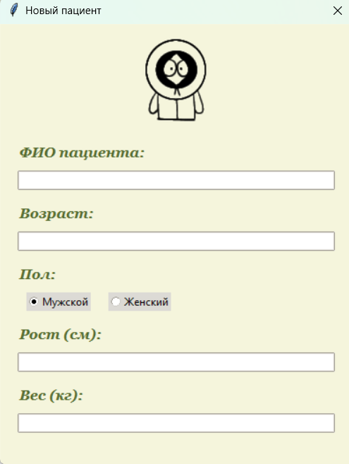
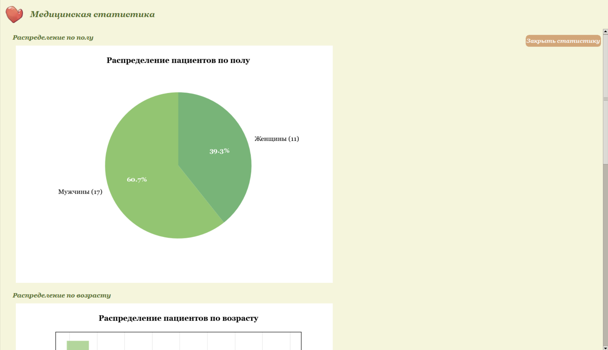

# Dear Patients
*Смотрите, мертвые! Это не очередной дурацкий софт!*

## Что это?!

Это прога, которая НЕ заставит вас кричать "Oh my God, they killed Kenny!" каждый раз когда вы пытаетесь найти карточку пациента.

## Установка (не бойтесь, тут нет никакого злого А.И.)

1.  **Скачайте:**
    ```bash
    git clone https://github.com/your-username/dear_patients.git
    cd dear_patients
    ```

2.  **Поставьте зависимости:**
    ```bash
    pip install Pillow
    ```
    *Если не установится - скажите "Screw you guys, I'm going home!" и попробуйте ещё раз*

3.  **Запускайте уже!**
    ```bash
    python dear_patients.py
    ```

    ### *Для параноиков (или крутых ребят):*
*Хотите быть как Эрик Картман? Сделайте виртуальное окружение!*
```bash
python -m venv venv
# Для Linux/macOS:
source venv/bin/activate
# Для Windows:
.\venv\Scripts\activate
```

## Что тут у вас в файлах?
```
dear_patients/
├── images/
│ ├── clinic_logo.png
│ ├── header_icon.png
│ ├── patient_avatar.png
│ ├── stats_decor.png
│ ├── tools_decor.png
│ ├── promo1.png
│ ├── promo2.png
│ └── promo3.png
├── dear_patients.py
├── patients.json
├── LICENSE
└── README.md
```

## Скриншоты (не обманываем!)




## Кто это сделал? (не Брэндон!)

Эти два чувака почти не спали, делая эту программу:

**[Горожанкина П.](https://github.com/)** - *Главный программист*: Делала чтобы всё работало и не падало. "You know, I learned something today..."
**[Калион В.](https://github.com/)** - *Дизайнер*: Сделал чтобы не было противно смотреть. "I'm not just sure, I'm dental sure!"

## Лицензия

Эта программа под лицензией **MIT**. Это значит можно делать с ней что угодно, кроме:
- Продавать правительству Канады
- Использовать для злых планов Картмана
- Говорить что это сделал Брэндон

Полный текст лицензии тут: [LICENSE](LICENSE) (если вам совсем нечем заняться)

## Хотите помочь? (ну вы и мазохисты)

Если нашли баг - не кричите "Oh my God!", просто создайте issue.
Если хотите что-то улучшить - делайте pull request. Но только ничего не сломайте.
